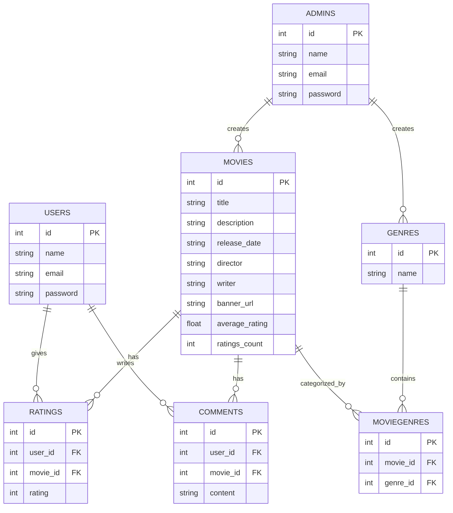

# Movie Rating App - Database Schema Design

This document describes the initial database schema for our Movie Rating web application. The goal is to keep things simple but scalable, similar to IMDB in concept, while supporting both admin and normal users.

## Admin

Admins will manage movies and categories.

**Fields**

- id (primary key)
- name: string
- email: string (unique)
- password: string (secure)
- timestamps

## Users

Normal users will be able to rate and comment on movies.

**Fields**

- id (primary key)
- name: string
- email: string (unique)
- password: string (secure)
- timestamps

## Movies

Movies can only be created by admins through the admin panel. Each movie has a title, description, and other details like release date, director, and writer. (We are make simple for now, movies data only uploaded by the admin side only)

**Fields**

- id (primary key)
- title: string
- description: text
- release_date: date
- director: string
- writer: string
- banner_url: string (for storing image path or Active Storage reference)
- average_rating: float (default 0.0)
- ratings_count: integer (default 0)
- timestamps

\*\*Since movies can belong to more than one category/genre (e.g., Action + Adventure + Drama), we will handle this through a join table.

## Genres

Categories define the genre of a movie (e.g., Action, Comedy, Drama).

**Fields**

- id (primary key)
- name (unique, required)
- timestamps

## MovieGenres (Join Table)

Because movies can belong to multiple categories, we’ll use a join table to connect `movies` and `genres`.

**Fields**

- id (primary key)
- movie_id (foreign key to movies)
- genre_id (foreign key to categories)
- timestamps

## Ratings

A user an give one rating per movie, with value between 1 and 5.

**Fields**

- id (primary key)
- user_id (foreign key to users)
- movie_id (foreign key to movies)
- rating: integer (required, 1–5)
- timestamps

## Comments

Users can leave comments on movies. Each comment is tied to both the user who wrote it and the movie it belongs to.

**Fields**

- id (primary key)
- user_id (foreign key to users)
- movie_id (foreign key to movies)
- content: text (required)
- timestamps

## Relationships Overview

- A **User** has many ratings and comments.
- An **Admin** can create movies and categories.
- A **Movie** has many comments and ratings, and it belongs to many categories through the join table.
- A **Category** can be linked to many movies through the join table.
- A **Rating** belongs to a user and a movie.
- A **Comment** belongs to a user and a movie.

---

---

